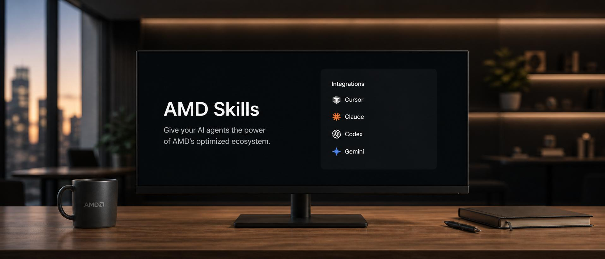

# AMD Skills

<div align="center">


[](https://cursor.com)
[](https://www.anthropic.com/claude-code)
[](https://openai.com/codex/)
[](https://ai.google.dev/gemini-api/docs/cli)
[](LICENSE)

Give your AI agents the power of AMD's optimized ecosystem.

[**Browse the Skill Catalog ->**](#the-catalog)

</div>

AMD Skills provide agents with knowledge, scripts, and conventions for working with AMD hardware and software.

Skills in this repository follow the standardized [Agent Skills](https://github.com/anthropics/skills) format and are designed to interoperate with the major coding agents like Cursor, Claude Code, OpenAI Codex, and Gemini CLI.

## What is a skill?

A skill is a self-contained folder that bundles everything an agent needs to perform a focused task: instructions, helper scripts, prompts, templates, and references. At its core is a `SKILL.md` file with YAML frontmatter, a `name`, and a short `description` that tells the agent *when* the skill should activate, followed by the guidance the agent reads while the skill is in use.

```
skills/
  rocm-doctor/
    SKILL.md
    scripts/
    references/
```

When an agent decides a skill is relevant (or you invoke it explicitly), it loads that `SKILL.md` and follows the instructions inside. Descriptions stay in context cheaply; the full body of a skill only loads when the task actually matches.

## Why a skill, not a doc?

Documentation describes an API surface: every flag, every option, neutral by design. A skill encodes the opinionated path: which flags, which container image, which `gfx` target, which environment variables, in what order. It captures the decisions a senior AMD engineer makes without thinking, in a form the agent can apply consistently across teams and repositories.

Skills earn their keep on repeated, opinionated workflows, exactly where the AMD stack lives.

## The catalog

The initial catalog is organized into four focus areas.

### Hardware-native skills

Diagnose, configure, and tune AMD silicon directly.

| Skill | What it does |
| --- | --- |
| `rocm-doctor` | Detect driver / kernel / ROCm / framework mismatches and propose fixes. |
| `gfx-target-chooser` | Pick the right `gfx942` / `gfx90a` / `gfx1100` target and matching compiler flags. |
| `mi300x-tuner` | Opinionated training and inference tuning for MI300X, including TunableOp, FSDP, and FlashAttention. |
| `rocm-container-picker` | Map a workload to a known-good `rocm/*` container image. |
| `ryzen-ai-deploy` | Prepare, quantize, and deploy models to Ryzen AI NPUs across the ONNX, PyTorch, and hybrid CPU/NPU/iGPU paths. |

### Application integration

Embed AMD-optimized AI into end-user applications.

| Skill | What it does |
| --- | --- |
| `local-ai-app-integration` | Integrate local AI into cloud LLM apps for offline support, better privacy, and lower API costs. |
| `local-ai-use` | Route image generation, text-to-speech, and speech-to-text through a local AI Server to reduce token/cost usage. |

### Cross-stack porting

Bring existing workloads onto AMD.

| Skill | What it does |
| --- | --- |
| `cuda-to-hip` | Port CUDA kernels with `hipify` and flag anything that needs manual review. |
| `triton-amd-port` | Port Triton kernels to the AMD backend with parity and performance checks. |
| `vllm-rocm` | Stand up vLLM on AMD with the right environment variables and model configurations. |
| `pytorch-rocm-setup` | Get a known-good PyTorch + ROCm stack running on a target node, end to end. |

### Profiling and delivery

Close the loop from trace to fix to ship.

| Skill | What it does |
| --- | --- |
| `rocprof-capture` | Capture and interpret a `rocprof` trace for a workload. |
| `omniperf-tune` | Run `omniperf`, locate the bottleneck, and suggest the fix. |
| `migraphx-deploy` | Compile an ONNX model with MIGraphX and benchmark it on a target. |
| `rocm-ci-template` | Drop-in GitHub Actions for AMD-targeted projects. |

> Skills land incrementally; see [Status](#status) for what is available today.

## A federated catalog

The AMD stack is large and moves fast. ROCm, HIP, MIGraphX, vLLM-AMD, Ryzen AI, and framework integrations each have their own team, release cadence, and validation matrix. A single monorepo of skills, maintained by one central team, would always be a step behind.

So skills here are **federated**: each skill is owned and versioned by the team that owns the product it describes, and this repository is the **catalog** that brings them together.

```
                ┌─────────────────────────────────────────────────────┐
                │                amd/skills (this repo)               │
                │                                                     │
                │   skills/         catalog/         .*-plugin/       │
                │   in-repo skills  pointers         agent manifests  │
                └──────────────────────┬──────────────────────────────┘
                                       │  one install
                                       ▼
                              your AI coding agent
                                       ▲
                                       │  resolves pointers to
       ┌───────────────┬───────────────┼───────────────┬────────────────┐
       │               │               │               │                │
   ROCm/ROCm       ROCm/HIP        Ryzen AI repo   lemonade-sdk    ...more
   rocm-doctor/    cuda-to-hip/    ryzen-ai-deploy/  local-ai-app-   product
   gfx-target-...  triton-amd-...  ...               integration/    repos
```

Concretely:

- The `cuda-to-hip` skill lives with the HIP project.
- `rocm-doctor` lives with the ROCm release tree.
- `ryzen-ai-deploy` ships with Ryzen AI.
- `local-ai-app-integration` is incubating in this repo today and will graduate to `lemonade-sdk/lemonade`.

Each skill stays close to the engineers who ship the underlying product, the CI that validates it, and the release tag that pins it.

This repo also acts as an **incubator**: a skill can start its life under `skills/` here to iterate quickly, then graduate to its product repo and be re-pointed from `catalog/` once it has a clear owner, with no change for installed users.

### What this means for you

- **One install, full coverage.** You add this repository through the plugin flow of your agent and you get the whole AMD catalog, so you do not need to track and install skills product by product.
- **Skills update with the products they describe.** When ROCm cuts a new release, the ROCm team updates the ROCm skills as part of that release. You see the new behavior the next time you pull the catalog.
- **Skills you can trust.** Each skill is signed off by the team that owns the underlying product, not assembled second-hand by a separate documentation team.

### What this means if you contribute

- **In-repo skills** (Path A below) are best for cross-cutting workflows that do not have a natural product home.
- **Product-repo skills** (Path B below) are best for skills that should live and version with a specific product. You add the skill folder to your product repo and open a small PR here that registers it in `catalog/` with a pinned tag. CI validates the linked skill against the same rules as in-repo skills, and the central plugin manifests surface it through the same one install.

### Repository layout

```
skills/             # Skills authored in this repository
catalog/            # Manifest pointers to skills that live in product repositories
.cursor-plugin/     # Cursor plugin manifest
.claude-plugin/     # Claude Code marketplace manifest
.github/workflows/  # CI for validating skills and manifests
scripts/            # Tooling for publishing and regenerating manifests
```

## Installation

AMD Skills are compatible with Cursor, Claude Code, OpenAI Codex, and Gemini CLI. The general flow:

### Cursor

Install the AMD plugin from this repository through the Cursor plugin flow. The repo ships a `.cursor-plugin/plugin.json` so skills are discoverable as soon as the plugin is enabled.

### Claude Code

Register this repository as a plugin marketplace, then install individual skills:

```bash
/plugin marketplace add amd/skills
/plugin install <skill-name>@amd/skills
```

### OpenAI Codex

Copy or symlink the desired folders from `skills/` into one of Codex's standard skill locations (for example `$REPO_ROOT/.agents/skills` or `$HOME/.agents/skills`). Codex will discover the `SKILL.md` files automatically.

### Gemini CLI

A `gemini-extension.json` will be provided so the repo can be installed as a Gemini CLI extension:

```bash
gemini extensions install https://github.com/amd/skills.git --consent
```

## Using a skill

Once a skill is installed, reference it in plain language while talking to your agent. For example:

- "Integrate local AI capabilities into my app with Embeddable Lemonade."
- "Use the `pytorch-rocm-setup` skill to get PyTorch running on this MI300X node."
- "Use the `cuda-to-hip` skill to convert these CUDA kernels and flag anything that needs manual review."
- "Use the `migraphx-deploy` skill to compile this ONNX model for `gfx942` and benchmark it."
- "Use the `omniperf-tune` skill to find the bottleneck in this training step."

The agent loads the matching `SKILL.md` and any helper scripts, then carries out the task. In most cases the agent will pick the right skill on its own from the description; explicit invocation is a fallback, not a requirement.

## Contributing a skill

We welcome contributions from AMD engineers, partners, and the community. There are two contribution paths, matching how the catalog is organized.

### Path A: Skills authored in this repository

Best for cross-cutting skills that do not have a natural product home.

1. Copy an existing skill folder under `skills/` as a starting point and rename it.
2. Update the `SKILL.md` frontmatter so the `name` and `description` clearly explain *what* the skill does and *when* an agent should reach for it.
3. Add the supporting scripts, templates, and reference docs your instructions point to. Keep skills focused: one well-scoped task per skill is better than one mega-skill.
4. Register the skill in `.claude-plugin/marketplace.json` with a human-readable description (the marketplace description is for humans browsing the catalog; the `SKILL.md` description is what the agent uses for routing).
5. Regenerate the Cursor manifest so it tracks the new skill:
   ```bash
   ./scripts/publish.sh   # writes .cursor-plugin/plugin.json
   ```
6. Validate the skill locally before pushing:
   ```bash
   ./scripts/check.sh   # validates every SKILL.md and that manifests are in sync
   ```
7. Open a pull request. The `validate` GitHub Actions workflow runs `./scripts/check.sh` and must pass before merge. See [AUTHORING.md](AUTHORING.md#validating-locally) for the full set of enforced rules.

### Path B: Skills authored in a product repository

Best for skills that should ship and version with a product (HIP, MIGraphX, Ryzen AI, vLLM-AMD, etc.).

1. Add the skill folder to your product repository; a common location is `.agents/skills/<skill-name>/`.
2. Open a pull request here that adds an entry to `catalog/` pointing at the skill's location and pinning a tag.
3. CI will validate the linked skill against the same rules as in-repo skills, and the central plugin manifests will surface it through one install.

### Writing tips

See [AUTHORING.md](AUTHORING.md) for the full authoring guide, including when a task is a good fit for a skill, how to write a description that routes correctly, and the conventions every AMD skill should follow. The essentials:

- Optimize the `description` for *agent routing*, not marketing copy. Describe the user's goal, not how the skill works internally.
- Be explicit about prerequisites: ROCm version, kernel, GPU architecture, container image.
- Prefer scripts and runnable commands over prose where possible.
- Call out known pitfalls: driver mismatches, unsupported architectures, and environment variables that silently change behavior.

## Status

This repository is in its early days. In-repo skills include `skills/local-ai-app-integration/` and `skills/local-ai-use/`, seeding the **Application integration** focus area. The Hardware-native, Cross-stack porting, and Profiling and delivery focus areas are being built out incrementally alongside manifests and CI. Expect rapid iteration. File an issue if there is a workflow you want covered, or open a PR with a skill you have been wanting to share.

## License

Released under the MIT License. See [LICENSE](LICENSE) for details.
